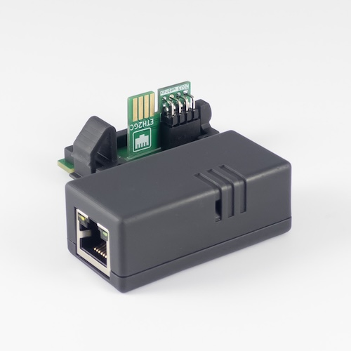
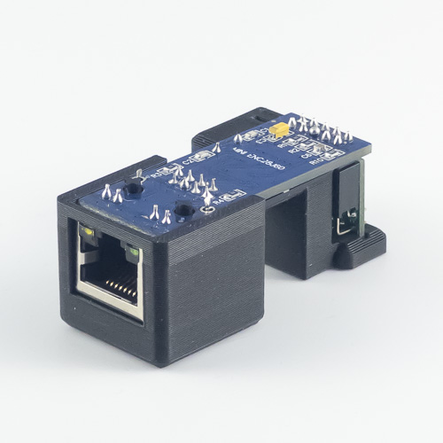

# ETH2GC - Broadband Adapter Emulator

Thanks to [@Extrems](https://github.com/Extrems) and his work on [Swiss](https://github.com/emukidid/swiss-gc/) we can now use cheap off-the-shelf Ethernet modules to emulate rare and expensive Broadband Adapter for the GameCube.

Some of the cool things you can do with **ETH2GC**:
* Play Mario Kart: Double Dash!! online multiplayer with Kirbymimi's online mod
* Play Phantasy Star Online on private servers like [Schthack](https://schtserv.com/)
* Play all retail GameCube games that came with LAN and Online support
* Dump your discs and game saves via network
* Debug your own homebrew applications
* ...and much more

ETH2GC is a project bringing together various Ethernet adapter hardware variants. The project is actively supported and more Ethernet NICs are planned to be supported in the future.

Visit **#eth2gc** on:

## 📚 Documentation
More extensive documentation including ordering and build guides is available at [**support.webhdx.dev**](https://support.webhdx.dev).

## 🌐 ETH2GC Sidecar

| Ethernet NIC | Connection        | Console compatibility  |
|--------------|-------------------|------------------------|
| **ENC28J60** | **Serial Port 2** | **DOL-001 (with SP2)** |

**ETH2GC Sidecar** is premium hardware variant that offers much tidier setup. It's not only compatible with GameBoy Player but also routes cables neatly towards the back of the console. It's secured using springy clip, similar to how original Serial Port 2 cover is mounted. 

> [!TIP]
> This variant is only available through me store as a fully assembled unit or DIY kit. If you are interested, please [visit my store 🛍️](https://store.webhdx.dev/)

## 🌐 ETH2GC Lite

| Ethernet NIC | Connection        | Console compatibility  |
|--------------|-------------------|------------------------|
| **ENC28J60** | **Serial Port 2** | **DOL-001 (with SP2)** |

This is the simplest adapter available. It uses a single PCB that interfaces ENC28J60 module with GameCube. **ETH2GC Lite** is compatible with most DOL-001 consoles as long as they have Serial Port 2. Panasonic Q, DOL-101 and possibly some other less common models are not supported. This variant is also incompatible with GameBoy Player but it's possible to trim through hole legs and replace a capacitor on ENC28J60 board to make it fit.

To make your own **ETH2GC Lite** you need to:
- order parts using Parts List below
- do some soldering but don't worry - it's a perfect project for newbies!
- print or get printed 3D case design
- assemble everything

> [!TIP]
> Are you interested in buying fully assembled unit or DIY kit? I'm selling these [on my store 🛍️](https://store.webhdx.dev/)

### Parts list
| Part                                              | Quantity | Links                                                                                                                                                                                                                                                                                          |
|---------------------------------------------------|----------|------------------------------------------------------------------------------------------------------------------------------------------------------------------------------------------------------------------------------------------------------------------------------------------------|
| ENC28J60 MINI                                     | 1        | [AliExpress](https://s.click.aliexpress.com/e/_DlkjMGp)                                                                                                                                                                                                                                        |
| 2x5P Female Headers 8.5mm P=2.54mm Right-Angle | 1        | [LCSC](https://www.lcsc.com/product-detail/Female-Headers_Liansheng-FH-00843_C2685127.html) [Mouser](https://www.lcsc.com/product-detail/Female-Headers_Liansheng-FH-00843_C2685127.html) [Digikey](https://www.lcsc.com/product-detail/Female-Headers_Liansheng-FH-00843_C2685127.html) |
| PCB                                               | 1        | [PCBWay](https://www.pcbway.com/project/shareproject/ETH2GC_Lite_Broadband_Adapter_Emulator_for_Nintendo_GameCube_873eba5c.html)                                                                                                                                                               |

### Ordering PCB

The PCB is really simple and it shouldn't be expensive to order. You can use OshPark, JLCPCB, PCBWay, AISLER etc. To order the PCB, download *.zip file from [Releases page](https://github.com/webhdx/ETH2GC/releases/latest) containing PCB gerbers and upload them to manufacturer website. There are a few requirements you have to pay attention to during order:

- PCB Thickness: **1.2mm**
- Finish: **ENIG** (HASL might work but it is not recommended)

If you haven't done it before, you can order from PCBWay using [this link](https://www.pcbway.com/project/shareproject/ETH2GC_Lite_Broadband_Adapter_Emulator_for_Nintendo_GameCube_873eba5c.html). Remember to set required settings during order process.

*By buying from the links above, I get small commision at no additional charge for you. Thanks for supporting the project 🙏*

## Final words
- ⚠️ **Please note this project is under Non Commercial license. Selling ETH2GC modules is strictly prohibited.**
- Please check out other awesome projects: [Swiss](https://github.com/emukidid/swiss-gc/) and [GBI](https://www.gc-forever.com/wiki/index.php?title=Game_Boy_Interface). Consider supporting [@Extrems](https://github.com/Extrems) via [his Patreon](https://www.patreon.com/Extrems). 
- Greetings to #gc-forever crew :wave: